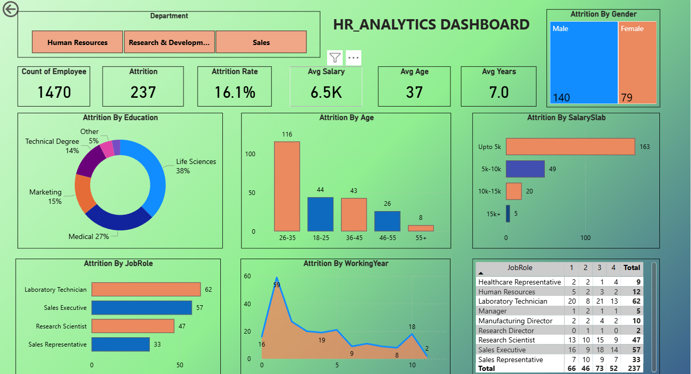

HR Analytics Dashboard 📊 | Project Overview

The HR Analytics Dashboard is a Power BI project created to analyze employee data and understand attrition trends.
It presents key HR metrics in a clear and interactive format to support data-driven decision-making.
This project focuses on transforming raw HR data into meaningful insights using effective data visualization.

Business Objectives:
Analyze overall employee count and attrition, identify departments with high employee turnover, understand attrition trends based on age, salary, education, and job role, and provide a consolidated view of HR performance through interactive visuals.

Key Performance Indicators (KPIs):
Total Employees | Attrition Count | Attrition Rate | Average Salary | Average Age | Average Years at Company

Dashboard Analysis:
The dashboard includes interactive visualizations for attrition analysis based on Department, Gender, Education Background, Age Group, Salary Slab, Job Role, and Working Years.
Filters and slicers allow users to explore insights dynamically.

Dashboard Preview:

Tools & Technologies:
Power BI for data modeling, DAX calculations, and dashboard visualization, and Excel / CSV as the data source.

Key Outcomes:
Clear visibility into employee attrition patterns, identification of high-risk employee segments, improved understanding of workforce structure, and demonstration of practical Power BI dashboarding skills.

Conclusion:
This project demonstrates hands-on experience in HR analytics and Power BI dashboard development, highlighting the ability to convert business requirements into clear and actionable visual insights.
